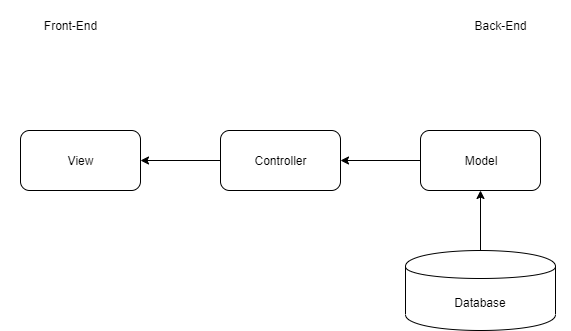
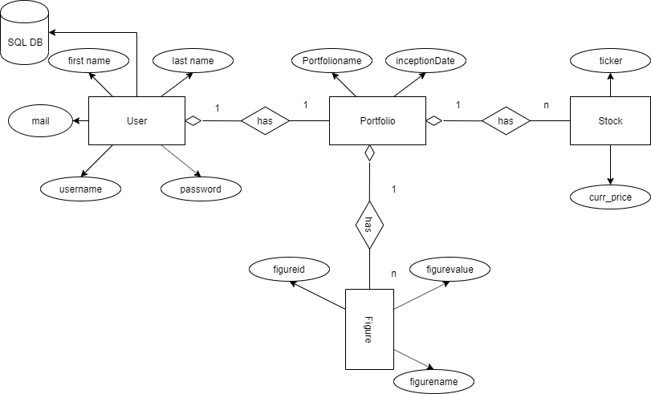

## 1. Introduction

### 1.1 Purpose

This document provides a comprehensive architectural overview of the system, using a number of different architectural 
views to depict different aspects of the system. It is intended to capture and convey the significant architectural 
decisions which have been made on the system.

### 1.2 Scope

This document describes the technical architecture of the bookly project, including module structure and dependencies as 
well as the structure of classes.

### 1.3 Definitions, Acronyms and Abbreviations

| Abbreviation | Description                            |
| ------------ | -------------------------------------- |
| API          | Application programming interface      |
| MVC          | Model View Controller                  |
| REST         | Representational state transfer        |
| SDK          | Software development kit               |
| SRS          | Software Requirements Specification    |
| UC           | Use Case                               |
| VCS          | Version Control System                 |
| N/A          | Not Applicable                         |

### 1.4 References

| Reference                                                                        						              | Date       |
|-----------------------------------------------------------------------------------------------------------|------------|
| <a href="https://hertzsch2.wixsite.com/stats-screening">Stats Screening Blog</a>                         	| 25/12/2019 |
| <a href="https://github.com/GeorgHs/Stats-Screening">Git</a>         				                              | 25/12/2019 |
| <a href="https://dhbw-karlsruhe.myjetbrains.com/youtrack/agiles/108-5/109-115">YouTrack</a>			          | 25/12/2019 |

### 1.5 Overview

This document contains the architectural representation, goals and constraints.

## 2. Architectural Representation

Our project bookly uses the classic MVC structure as follows:

source: Telusko, 
## 3. Architectural Goals And Constraints

Main technology is Django MVT. This framework includes backend as well as frontend operations. Besides, the controller/template and model language is Python. That way we have to worry about serialization. 

## 4. Use-Case View

This is our overall use-case diagram:

## 5. Logical View

### 5.1 Overview

We split our architecture according to the MVC architecture as follows:

Model: Model is going to act as the interface of your data. It is responsible for maintaining data. It is the logical data structure behind the entire application and is represented by a database (generally relational databases such as MySql, Postgres).
View: The View is the user interface — what you see in your browser when you render a website. It is represented by HTML/CSS/Javascript and Jinja files.
Template: A template consists of static parts of the desired HTML output as well as some special syntax describing how dynamic content will be inserted.

Benefits of Django Architecture –

    Rapid Development
    Loosely Coupled
    Ease of Modification

Drawbacks of MVC Architecture –

    Too much load on Model Component
    Development Complexity is high
    Two components are controlling View

In Python Django its called Model View Template.

### 5.2 Architecturally Significant Design Packages

We have a backend and a frontend module. The backend module contains our model. The frontend module contains our view. 
The Django MVT framework is realized. The controller cannot directly access the database. 

## 6. Process View

N/A

## 7. Deployment View

N/A

## 8. Implementation View

N/A

## 9. Data View

Our data view is modelled as followed:

## 10. Size and Performance

N/A

## 11. Quality/Metrics

To ensure a high quality we are using continuous integration. It automatically builds, tests, 
measures and deploys the application, if the respective previous step has not failed. This happens periodically and when 
changes are pushed to a branch. When merging the master branch into the deployment branch, the application will 
automatically be deployed as well after pushing the button.

For serving a most current documentation of our API, we are using autosummary/autodoc. It's constantly being updated. Using Sphinx as documentation language.

## 12. Patterns

N/A
